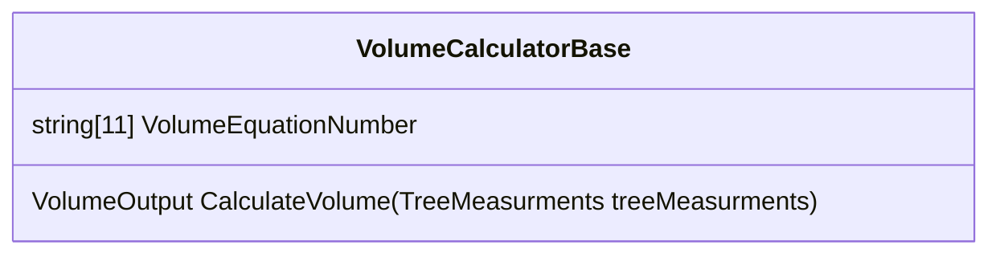
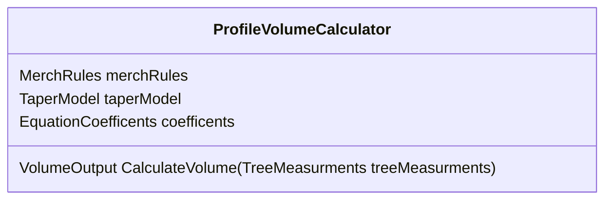
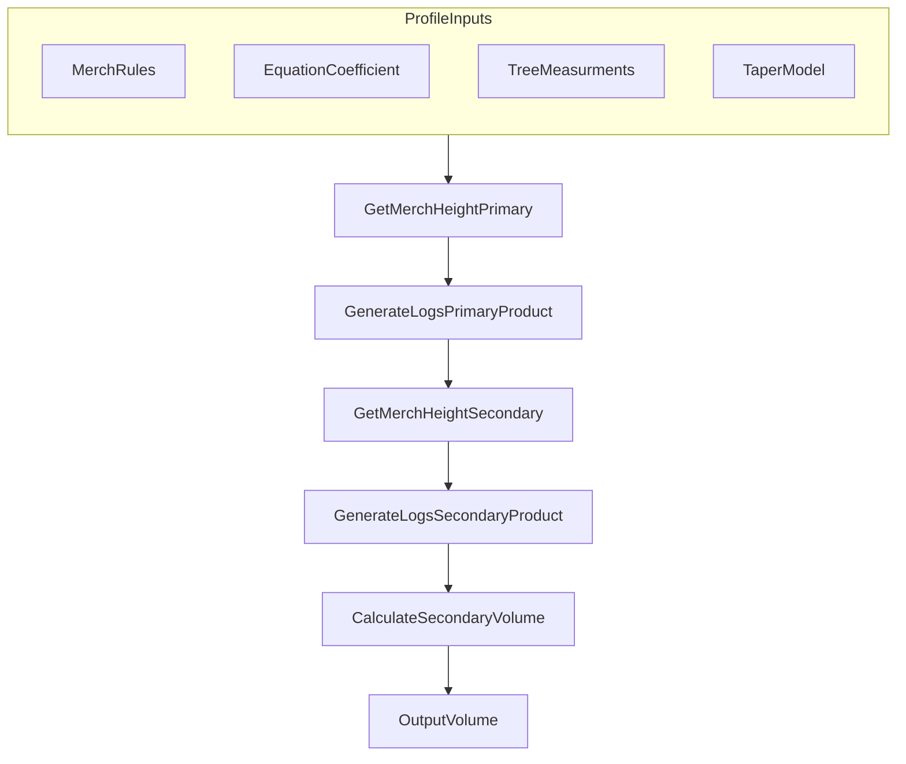
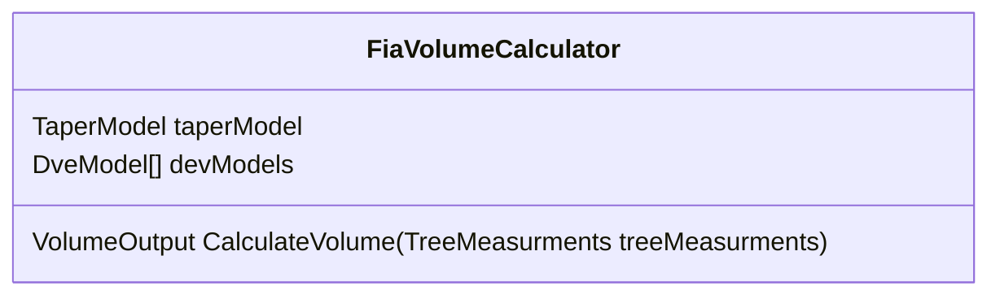
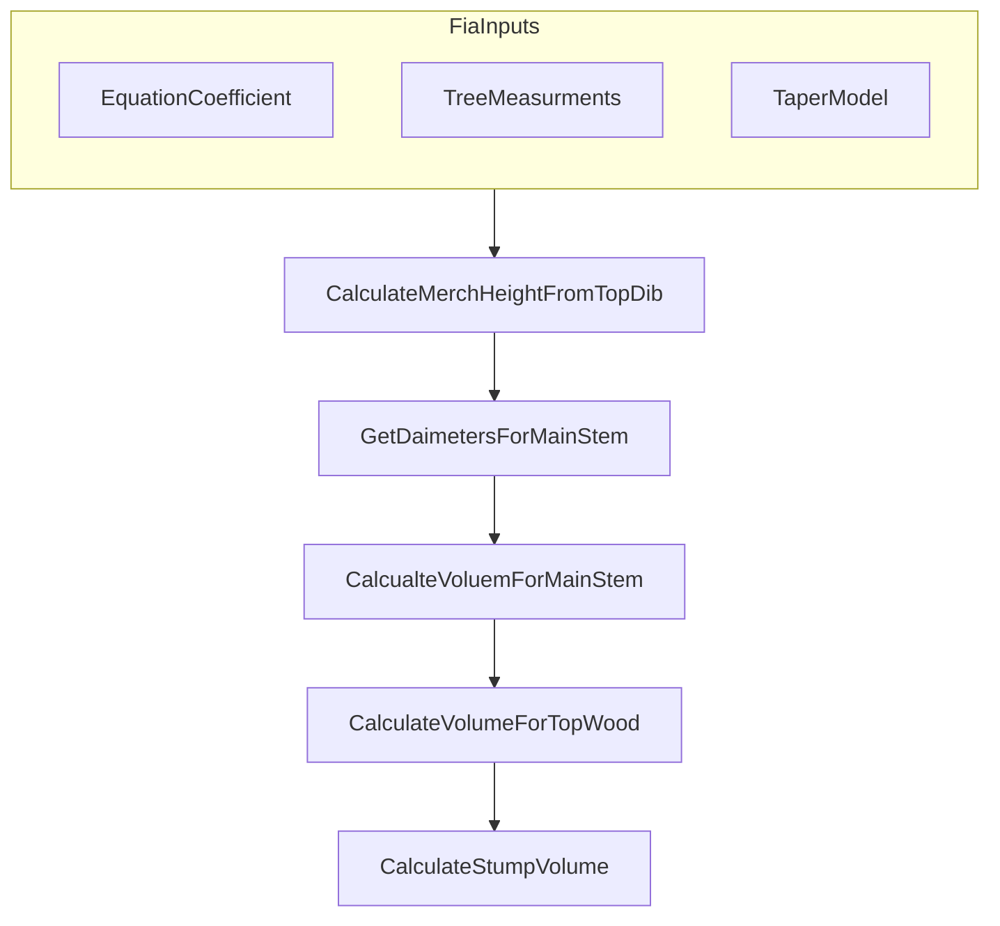
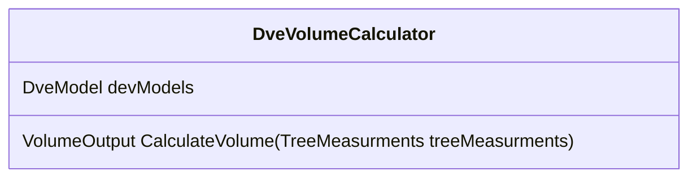
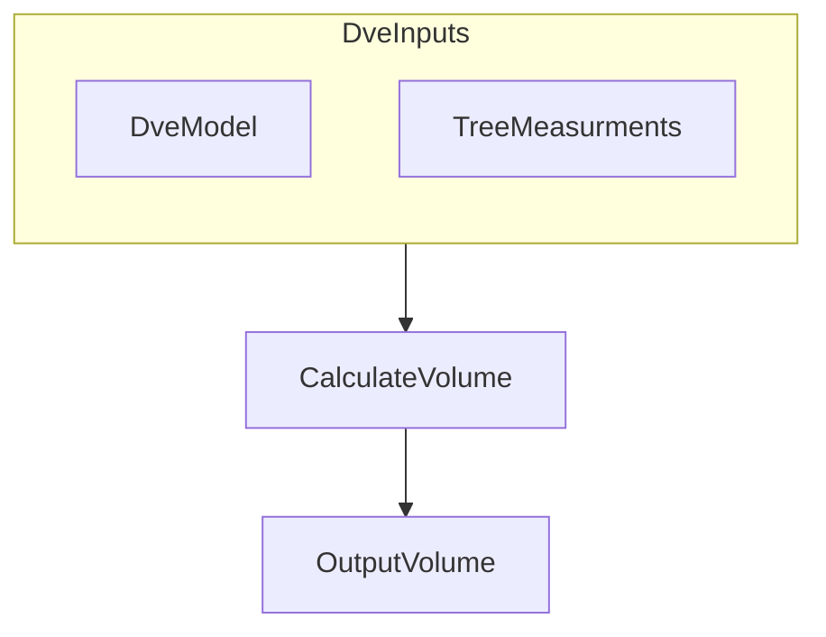
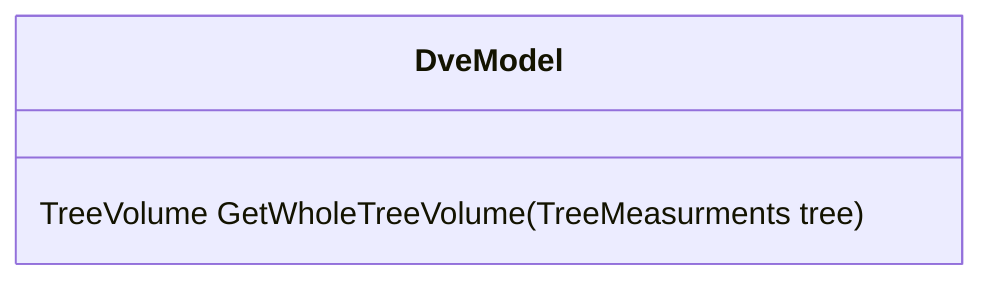

## Base Volume Calculator

## Profile Volume Calculator

## FIA Volume Calculator

Requited Tree measuremtnts: DBH and (TotalHeight or BrokenTopHeight)
MerchRule: TopDib (calculated)

Doesn't break tree into multple logs. Calculates volume for Stump, Main stem, and top

## DVE Volume Calculator

## DveModel

