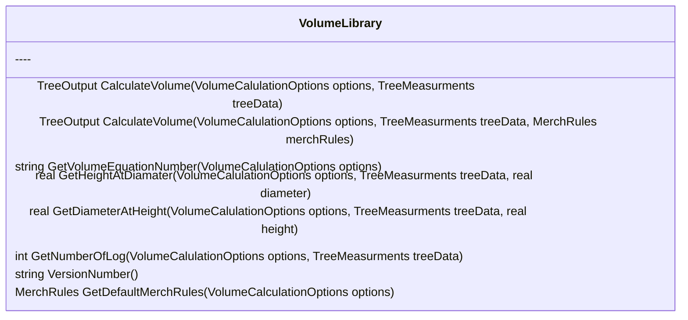
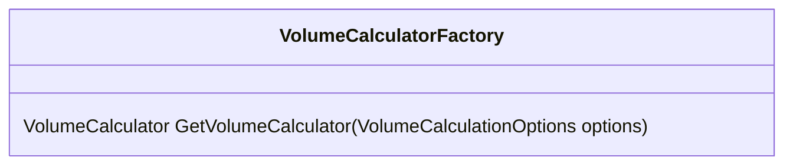
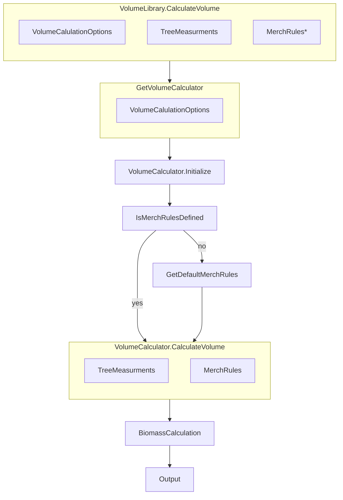

## VolumeLibrary Main Class

```mermaid
classDiagram
    class VolumeLibrary {
        TreeOutput CalculateVolume(VolumeCalulationOptions options, TreeMeasurments treeData)

        TreeOutput CalculateVolume(VolumeCalulationOptions options, TreeMeasurments treeData, MerchRules merchRules)
        
        string GetVolumeEquationNumber(VolumeCalulationOptions options)

        real GetHeightAtDiamater(VolumeCalulationOptions options, TreeMeasurments treeData, real diameter)

        real GetDiameterAtHeight(VolumeCalulationOptions options, TreeMeasurments treeData, real height)

        int GetNumberOfLog(VolumeCalulationOptions options, TreeMeasurments treeData)

        string VersionNumber() 

        ----
        MerchRules GetDefaultMerchRules(VolumeCalculationOptions options)
    }
```

```mermaid
classDiagram
  class VolumeCalculatorFactory {
        VolumeCalculator GetVolumeCalculator(VolumeCalculationOptions options)
  }

```

### CalculateVolume Outline

```mermaid
flowchart TB

    VLVC -->GetVolumeCalculator-->VolumeCalculator.Initialize--> 
    IsMerchRulesDefined-- yes -->VC 
    IsMerchRulesDefined-- no -->GetDefaultMerchRules 

    GetDefaultMerchRules--->VC

    
    --> BiomassCalculation --> Output

    subgraph VLVC[VolumeLibrary.CalculateVolume ]
        direction TB
        1a[VolumeCalulationOptions]
        1b[TreeMeasurments]
        1c[MerchRules*]
        
        
    end
    
    subgraph GetVolumeCalculator
        2a[VolumeCalulationOptions]
    end


    subgraph VC[VolumeCalculator.CalculateVolume]
        direction TB

        3a[TreeMeasurments]
        3b[MerchRules]


    end

```

