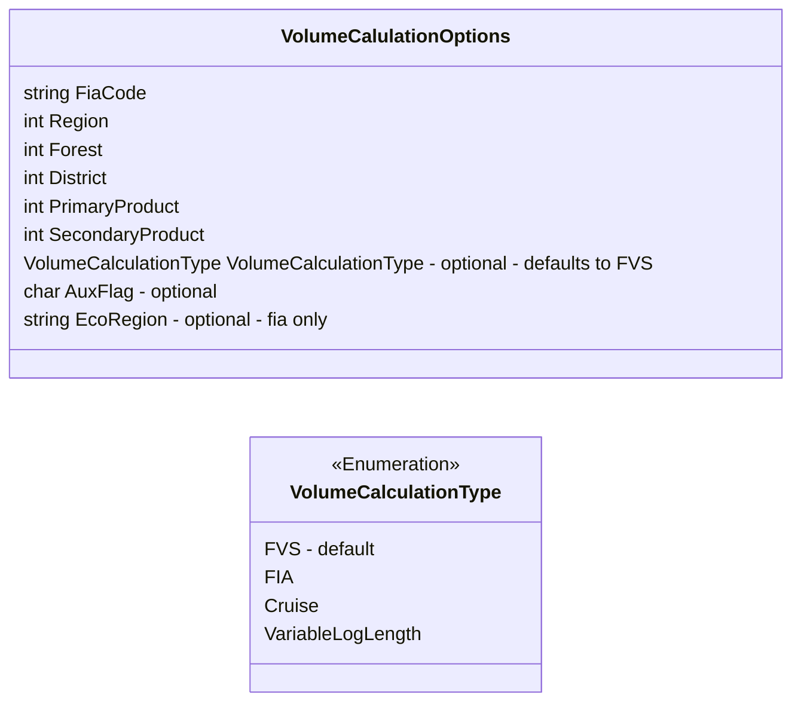
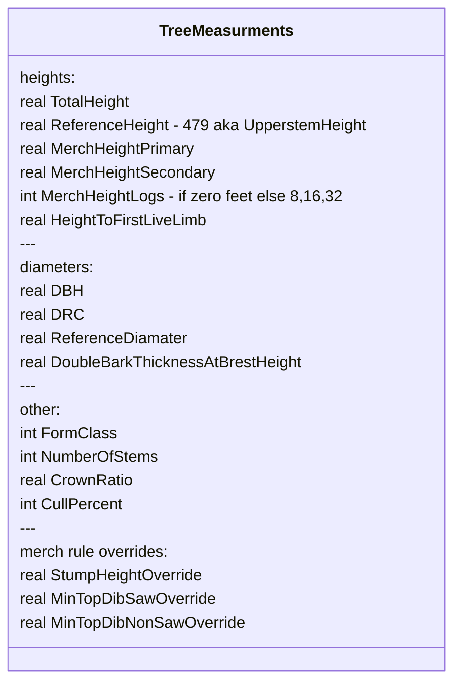
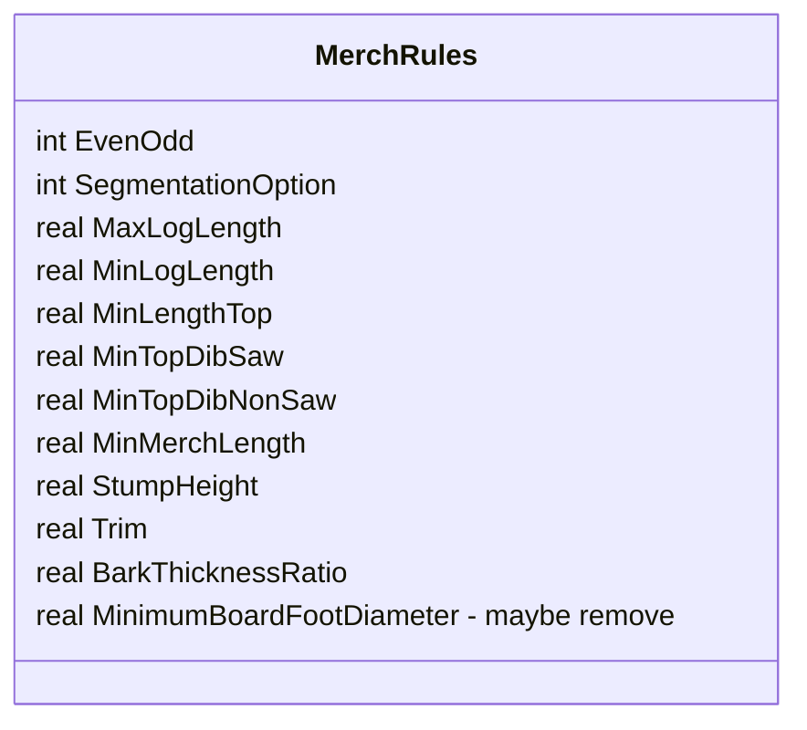

## Volume Library input Data Types

MerchRules.Opt -- enum value for different options for dealing with topwood

### VolumeCalulationOptions

#### AuxFlag - Single Char Value
Additional flag value to indicate
- Species Variant Info (young/old growth)
- Appraisal Group (R6 Dougfur, house logs)

### TreeMeasurments

#### MerchHeightLogs
Instead of using MerchHeightType we are now using MerchHeightLogs where if a value is provided as either 8, 16, 32 then implicitly the MerchHeight will be Logs, otherwise MerchHeights will be in Feet

### MerchRules

