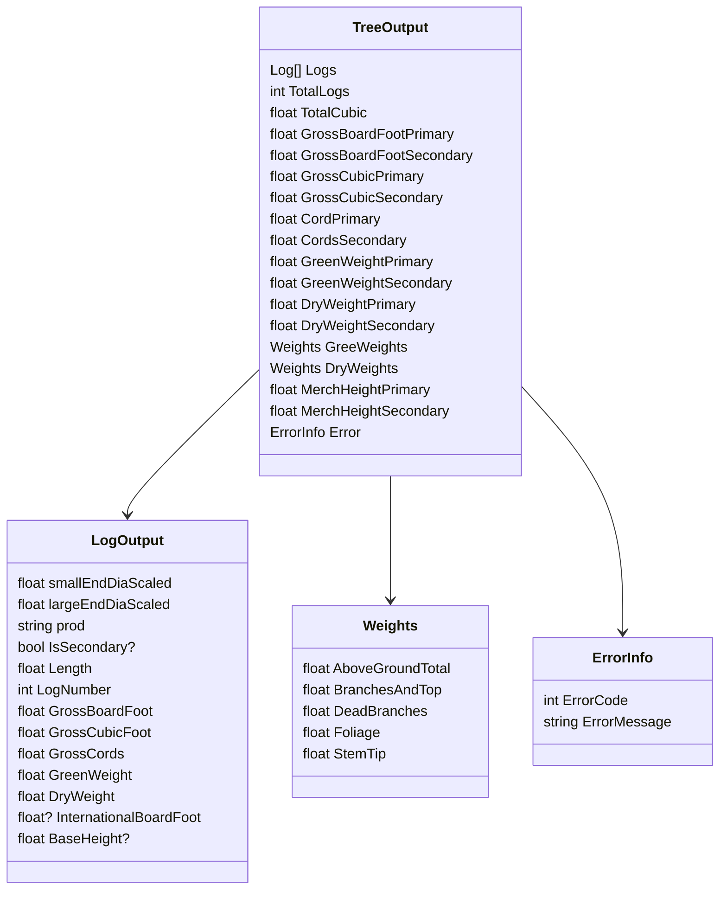

## Volume Library Output Datatypes
The primary output will be the `TreeOutput` data type. 

The `TreeOutput` data type contins the following core metrics:
 - a list of Logs with each log record containing mesurments, volumes and weights of individual log
 - Gross volumes of the tree
 - Green and Dry weights
 - Merch heights

