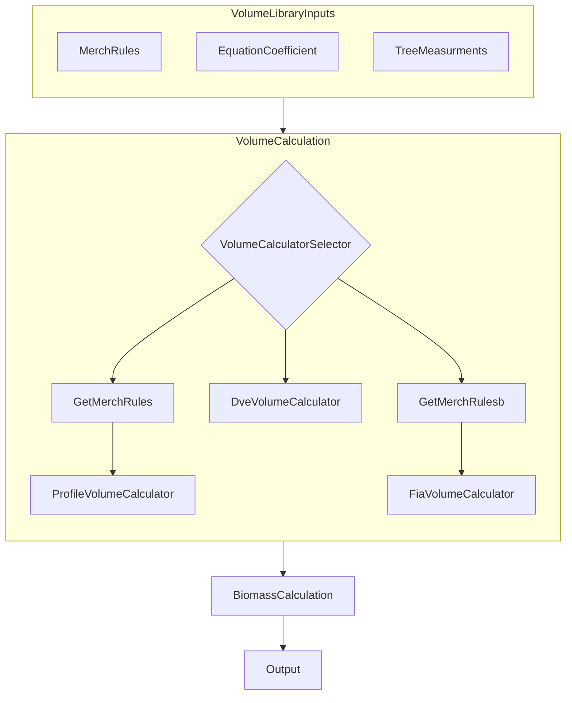
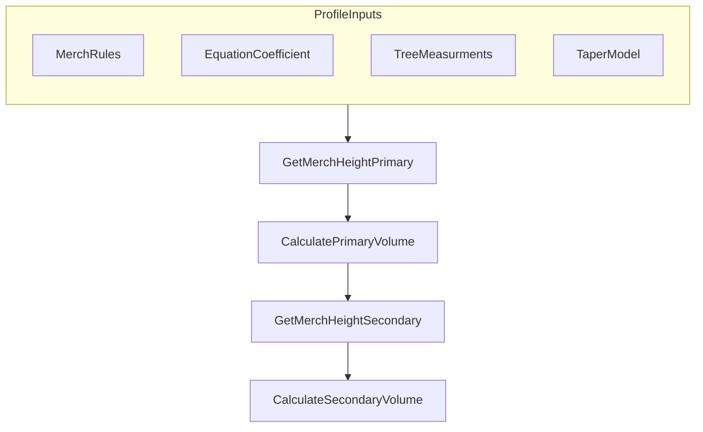
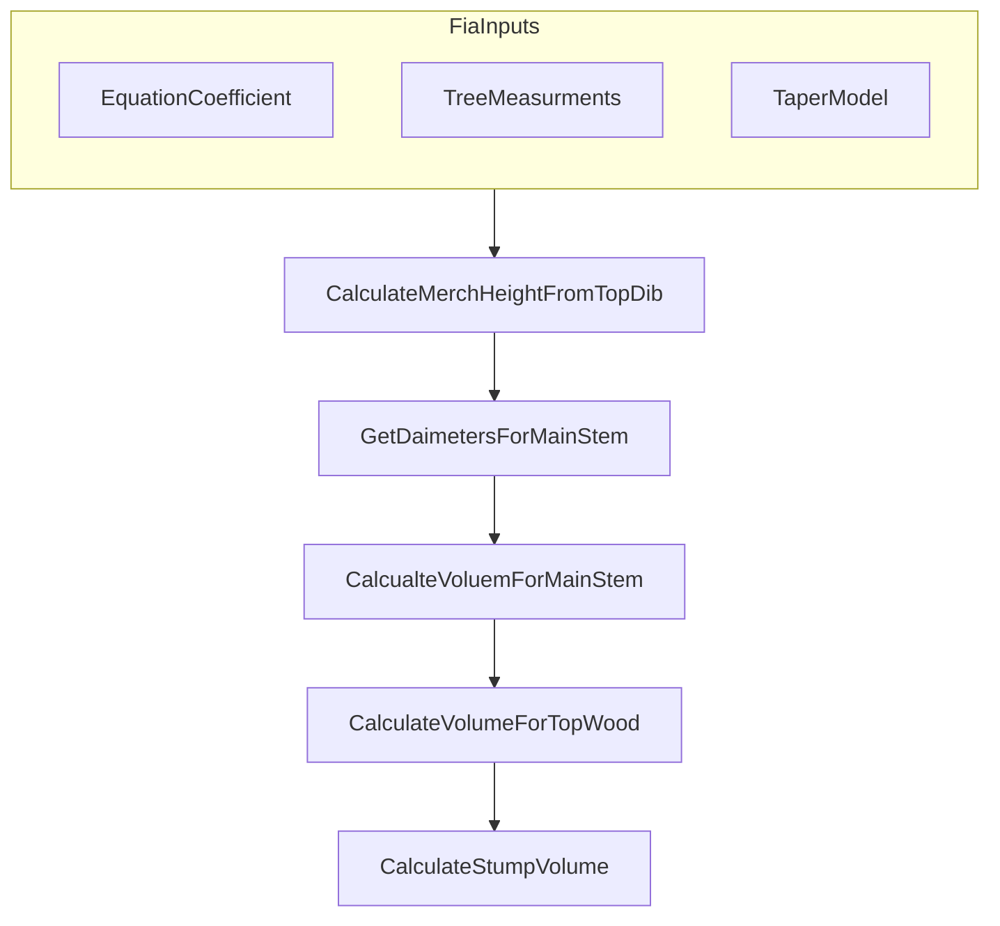
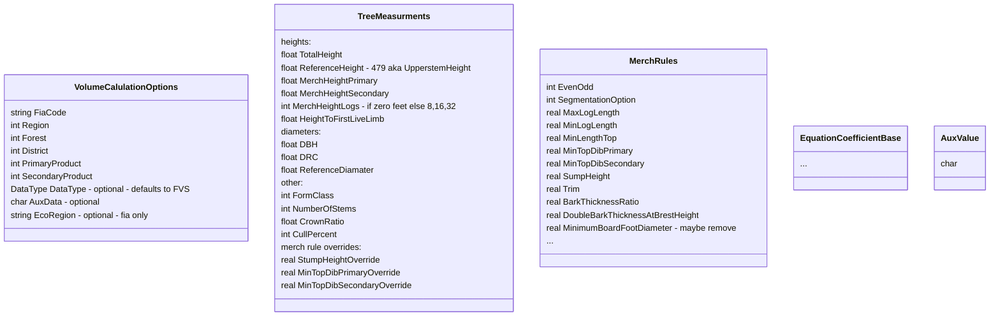
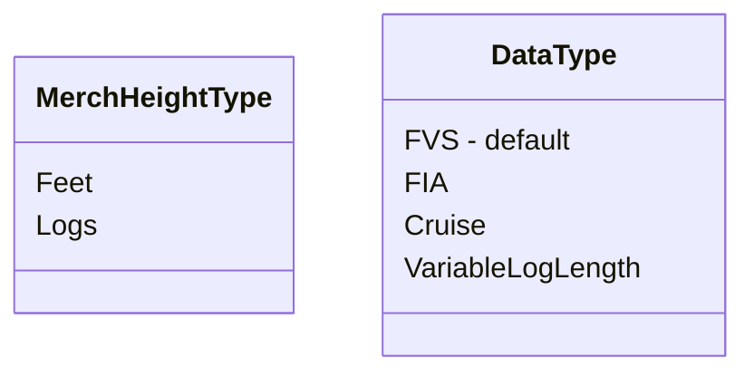
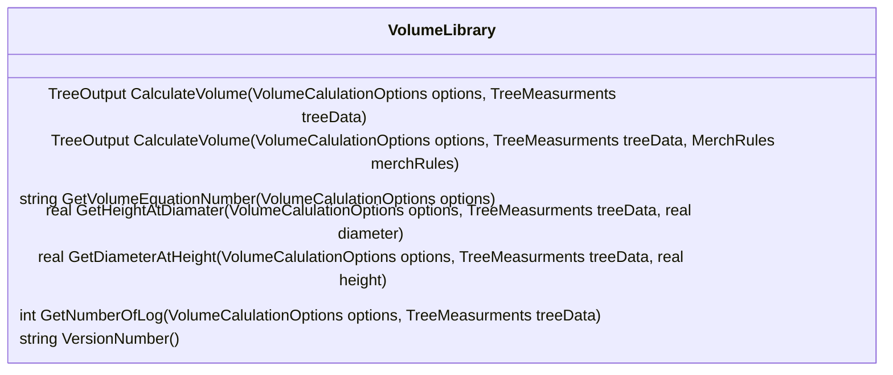

## Profile Volume Calculation

## FIA Volume Calculation
Requited Tree measuremtnts: DBH and (TotalHeight or BrokenTopHeight)
MerchRule: TopDib (calculated)

Doesn't break tree into multple logs. Calculates volume for Stump, Main stem, and top

## Volume Library input Data Types

MerchRules.Opt -- enum value for different options for dealing with topwood

### Additional Tree Values (AuxData)
Single Char Value

- Species Variant Info
- Appraisal Group

### MerchHeightLogs
Instead of using MerchHeightType we are now using MerchHeightLogs where if a value is provided as either 8, 16, 32 then implicitly the MerchHeight will be Logs, otherwise MerchHeights will be in Feet

### Enums

### VolumeLibrary Main Class
