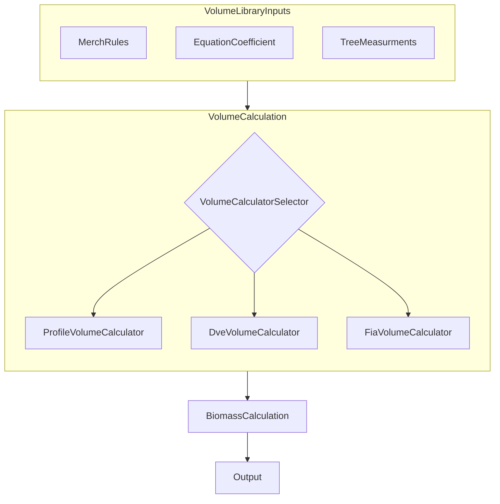
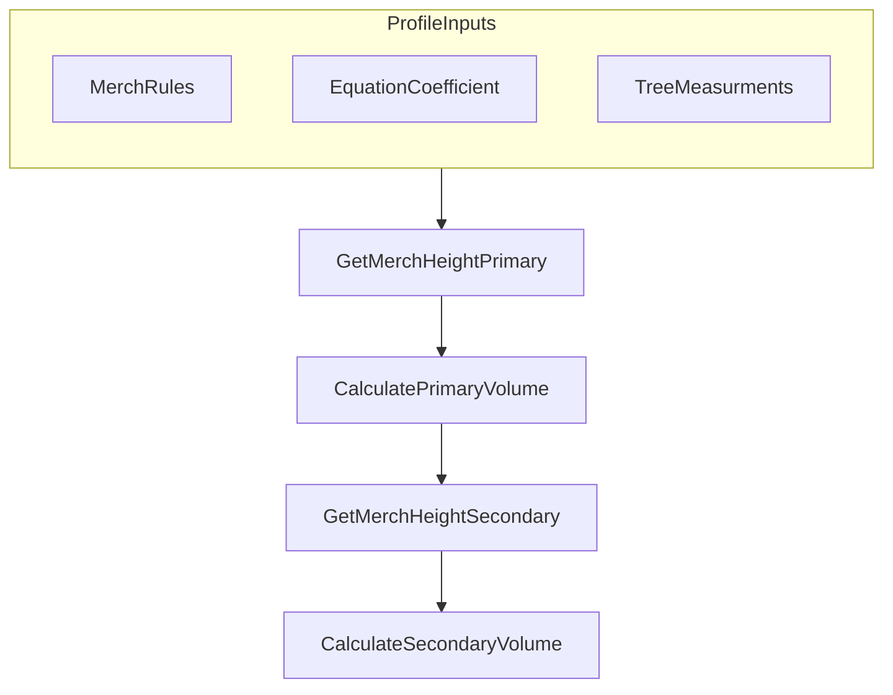
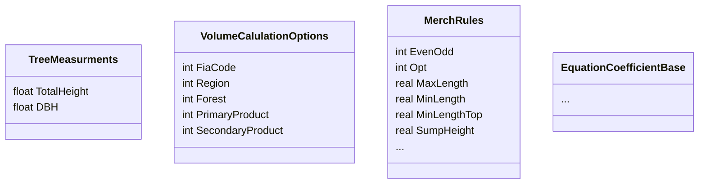

```mermaid
flowchart TB

    VolumeLibraryInputs --> VolumeCalculation --> BiomassCalculation --> Output

    subgraph VolumeLibraryInputs
        direction TB
        MerchRules
        EquationCoefficient
        TreeMeasurments
        
    end
    

    subgraph VolumeCalculation
        direction TB

        A{VolumeCalculatorSelector}
        A-->ProfileVolumeCalculator
        A-->DveVolumeCalculator
        A-->FiaVolumeCalculator
    end

```

## Profile Volume Calculation

```mermaid
flowchart TB
    ProfileInputs -->
            GetMerchHeightPrimary --> CalculatePrimaryVolume --> GetMerchHeightSecondary --> CalculateSecondaryVolume

    subgraph ProfileInputs
            direction TB
            MerchRules
            EquationCoefficient
            TreeMeasurments
            end
            
```

## Data Types

``` mermaid
classDiagram

    class TreeMeasurments {
        float TotalHeight
        float DBH
    }

    
    class VolumeCalulationOptions {
        int FiaCode
        int Region
        int Forest
        int PrimaryProduct
        int SecondaryProduct
    }


    class MerchRules {
        int EvenOdd
        int Opt
        real MaxLength
        real MinLength
        real MinLengthTop
        real SumpHeight
        ...
    }

    class EquationCoefficientBase {
        ...
    }
```