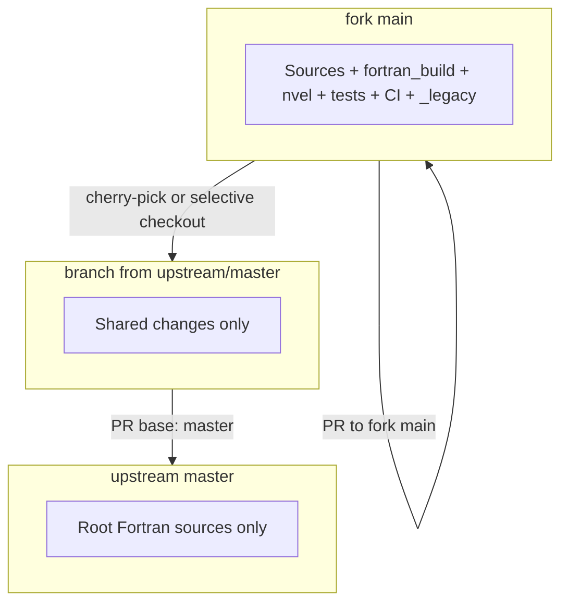
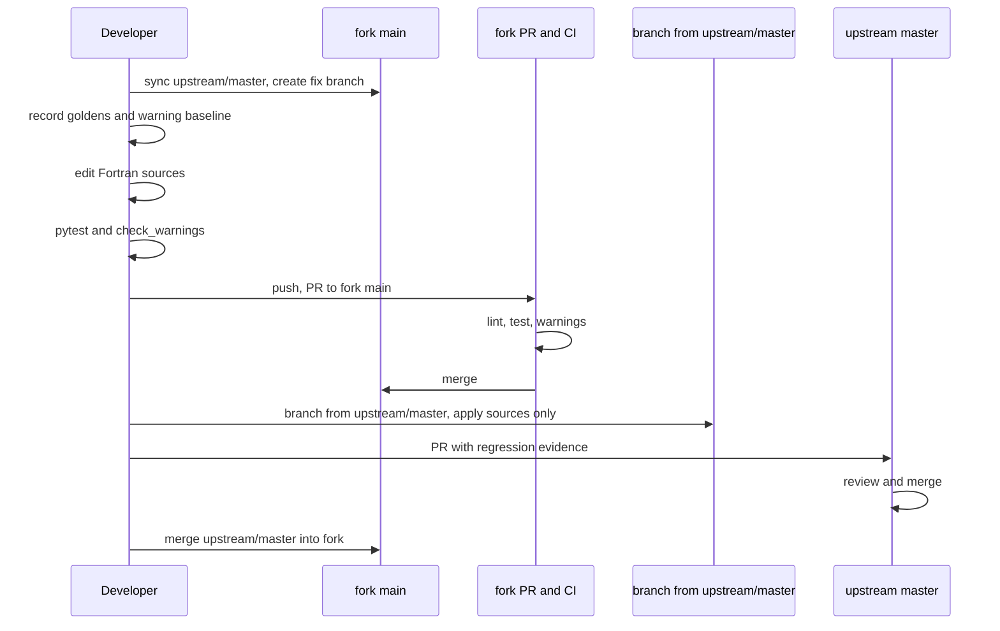

# Upstream contribution workflow

Fork policy for contributing warning fixes to [FMSC-Measurements/VolumeLibrary](https://github.com/FMSC-Measurements/VolumeLibrary). Related: [FORK.md](../FORK.md), [PLAN.md](PLAN.md), [tests/README.md](../tests/README.md).

## Context

This repository is a development fork of [FMSC-Measurements/VolumeLibrary](https://github.com/FMSC-Measurements/VolumeLibrary). The fork adds build tooling, Python regression tests, CI, and archived legacy content under `_legacy/`. Upstream keeps a flat layout of NVEL Fortran sources (`*.f`, `*.for`, `*.inc`) at the repo root and targets Windows/Intel DLL releases.

We need a repeatable process to:

1. Develop and verify changes on the fork with full regression tooling.
2. Submit **clean, reviewable PRs** to upstream that contain only shared work.
3. Document build setup and regression evidence for upstream reviewers who do not yet have fork CI or pytest infrastructure.

## Decision

Use a **two-track git workflow**:

- **Fork track** — develop on a feature branch off fork `main`, run all regression gates, merge via PR to fork `main` with full context (baselines, goldens, progress).
- **Upstream track** — branch from `upstream/master`, apply only the shared source changes, open a separate PR to FMSC with regression evidence in the PR body.

Do **not** open upstream PRs from fork `main` directly. Fork `main` includes fork-only paths that upstream does not want in source-fix PRs.

### Remotes and branches

| Remote | Repository | Default branch | Role |
|--------|------------|----------------|------|
| `origin` | Fork (`d-diaz/VolumeLibrary`) | `main` | Active development |
| `upstream` | `FMSC-Measurements/VolumeLibrary` | `master` | PR target |

Configure once:

```bash
git remote add upstream https://github.com/FMSC-Measurements/VolumeLibrary.git
git fetch upstream
```



## Workflow

### 1. Sync before starting work

```bash
git fetch upstream
git checkout main
git merge upstream/master
```

Resolve conflicts per [FORK.md](../FORK.md) (e.g. keep upstream content under `_legacy/` when paths diverge).

### 2. Create a fork development branch

```bash
git checkout -b fix/<scope> main
```

Use a descriptive scope (`fix/r10vol1-type-conversions`, `fix/volumelibrary-entry`). Prefer one logical batch per branch; split large batches by file or region when review size warrants it.

### 3. Establish regression baselines before editing sources

**Tier A changes** (correctness risk: type conversions, truncation, uninitialized variables — see [PLAN.md](PLAN.md)) require numerical goldens recorded **before** Fortran edits:

```bash
fortran_build/build_gfortran_shared.sh
python3 tests/record_goldens.py
pytest -v
```

Add cases to [tests/goldens/cases.json](../tests/goldens/cases.json) for any region, equation, or entry point not already covered. Commit goldens before source edits.

Capture the warning baseline for every batch:

```bash
fortran_build/check_warnings.sh
```

### 4. Edit sources

- Change only root sources listed in [nvel_fortran_sources.txt](nvel_fortran_sources.txt).
- Do **not** edit `_legacy/` for upstream-bound work.
- Do **not** touch fork-only tooling in the same commit as upstream-bound source fixes when avoidable (see commit structure below).

### 5. Run regression gates

After each file or sub-batch:

```bash
# Numerical gate (mandatory for Tier A)
fortran_build/build_gfortran_shared.sh
pytest -v

# Warning gate (every batch)
fortran_build/check_warnings.sh
```

**Pass criteria:**

| Gate | Requirement |
|------|-------------|
| Numerical | `pytest` passes; golden outputs unchanged within tolerance (default `1e-3`) |
| Warnings | Total count decreases or stays flat; no new Tier A warnings in touched files |
| CI | Fork PR green — lint, test, and warnings jobs in [.github/workflows/nvel-tests.yml](../.github/workflows/nvel-tests.yml) |

**Optional:** FVS smoke test before large Tier A upstream PRs (embed fork commit at `volume/NVEL` in [ForestVegetationSimulator](https://github.com/USDAForestService/ForestVegetationSimulator)). Not a daily gate; document in the upstream PR if run.

### 6. Commit on the fork (separate concerns)

Split commits so upstream extraction stays simple:

**Fork-only commit** (does not go upstream):

- `tests/goldens/cases.json` (new or updated cases)
- `fortran_build/warnings_inventory_baseline.csv`, `warnings_summary_baseline.md`
- `fortran_build/warnings_progress.md`

**Shared-source commit** (candidate for upstream):

- Root `*.f`, `*.for`, `*.inc` only

Example:

```text
fix r10vol1.f tier A type conversions — rebaseline warnings   # fork-only
Fix REAL*8 to REAL*4 conversions in r10vol1.f                   # upstream candidate
```

Push and open a **fork PR** to `origin/main`:

```bash
git push -u origin fix/<scope>
gh pr create --repo d-diaz/VolumeLibrary --base main --title "fix: …"
```

Merge after CI is green.

### 7. Isolate a clean upstream PR

Branch from upstream, not from fork `main`:

```bash
git fetch upstream
git checkout -b upstream/fix-<scope> upstream/master
```

Apply only shared changes.

**Option A — cherry-pick** (when the source-only commit is clean):

```bash
git cherry-pick <source-commit-sha>
```

**Option B — selective checkout** (safest):

```bash
git checkout fix/<scope> -- path/to/file.f
git add path/to/file.f
git commit -m "Fix … in path/to/file.f"
```

Verify the diff scope:

```bash
git diff upstream/master --stat
```

Expected: only root Fortran sources (and `.inc` if applicable). No
`fortran_build/`, `nvel/`, `tests/`, `_legacy/`, or CI files.

Push and open the upstream PR:

```bash
git push -u origin upstream/fix-<scope>
gh pr create \
  --repo FMSC-Measurements/VolumeLibrary \
  --head d-diaz:upstream/fix-<scope> \
  --base master \
  --title "…" \
  --body-file fortran_build/upstream_pr_template.md
```

### 8. Document regression evidence in the upstream PR

Upstream does not run fork CI. The PR body must include reproducible setup and results. Use [upstream_pr_template.md](upstream_pr_template.md) and fill in the placeholders before opening the PR.

After opening the upstream PR, add a row to [warnings_progress.md](warnings_progress.md) on the fork.

### 9. After upstream merge

```bash
git fetch upstream
git checkout main
git merge upstream/master
```

Keep fork `main` aligned with upstream so future PRs start from a current base.

## What belongs in upstream PRs

| Include in upstream PR | Keep on fork only |
|------------------------|-------------------|
| Root `*.f`, `*.for`, `*.inc` fixes | `_legacy/` archival moves |
| Shared tooling **if** FMSC agrees to adopt it (separate PR) | Fork CI, devcontainer, `pyproject.toml` |
| | `nvel/`, `tests/`, warning baselines (unless tooling PR) |

Per [PLAN.md](PLAN.md): do **not** bundle Phase 0 wrapper/test infrastructure with Fortran source-fix PRs. Propose tooling adoption in its own upstream PR when ready.

Prefer **one upstream PR per file** for large mechanical batches unless FMSC prefers grouped PRs.

## End-to-end sequence



## Consequences

**Positive**

- Upstream reviewers see small, focused diffs without fork housekeeping.
- Regression evidence is standardized and reproducible on the fork.
- Fork retains full history, baselines, and CI for ongoing development.

**Negative / trade-offs**

- Two PRs per change batch (fork + upstream) adds overhead.
- Cherry-picks can conflict if fork and upstream layouts diverge; selective checkout avoids some pain at the cost of losing commit SHA parity.
- Upstream reviewers depend on fork CI links until FMSC adopts similar tooling.

## Why two PRs?

- **PR fork `main` directly to upstream** — includes `_legacy/`, CI, Python wrapper; too large and unrelated for source fixes.
- **Develop only on upstream branches, no fork PR** — loses fork CI and baseline tracking before merge.
- **Single commit mixing sources and baselines** — hard to extract clean upstream diffs.
- **Skip numerical goldens for Tier B hygiene fixes** — Tier A still requires goldens; workflow stays one process with a lighter gate for Tier B.

## Example

See [PLAN.md — Batch 1](PLAN.md#batch-1--tier-a-regional-shape-files) for the first Tier A batch (`f_west.f`, `f_other.f`, `f_alaska.f`, …). The workflow above applies: record goldens, fix on a fork branch, merge fork PR, then branch from `upstream/master` with source-only changes and open an upstream PR using [upstream_pr_template.md](upstream_pr_template.md).
